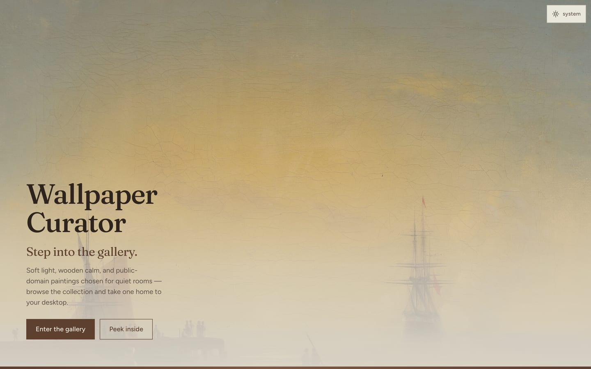
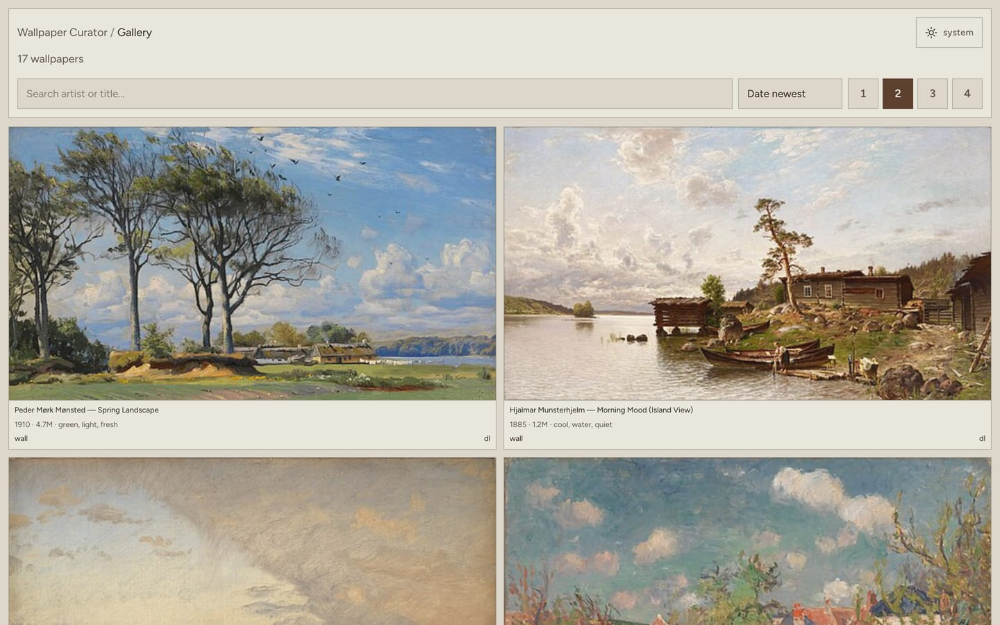

# Wallpaper Curator

A Vercel-deployable gallery of curated **public-domain** wallpapers — browse the collection, download, or set via Raycast / iOS share.

**Live:** [wallpaper-curator.vercel.app](https://wallpaper-curator.vercel.app)

- **Landing:** `/`
- **Gallery:** `/gallery`
- **Catalog:** `data/wallpapers.yaml`
- **MCP (agents):** `/api/mcp`
- **Agent guide:** [`/agents.md`](https://wallpaper-curator.vercel.app/agents.md) (`AGENTS.md`)
- **Raycast companion:** `raycast-extension/`

## Screenshots

Landing — full-bleed hero and gallery tease:



Gallery — search, sort, column density, wall / download:



## Local development

```bash
npm install
npm run dev
```

Open [http://localhost:3000](http://localhost:3000).

## MCP for agents

Agents can discover and search the library over Streamable HTTP:

`https://wallpaper-curator.vercel.app/api/mcp`

**Tools**

| Tool | Purpose |
| --- | --- |
| `list_facets` | Catalog size + artists / tones / sources |
| `search_wallpapers` | Free-text + artist/tone filters |
| `get_wallpaper` | One entry by id (image + thumb URLs) |

**Resource:** `wallpaper://catalog` — full catalog JSON.

### Cursor (`~/.cursor/mcp.json`)

```json
{
  "mcpServers": {
    "wallpaper-curator": {
      "url": "https://wallpaper-curator.vercel.app/api/mcp"
    }
  }
}
```

Locally while developing: `"url": "http://localhost:3000/api/mcp"`.

### Claude Desktop / stdio-only clients

```json
{
  "mcpServers": {
    "wallpaper-curator": {
      "command": "npx",
      "args": [
        "-y",
        "mcp-remote",
        "https://wallpaper-curator.vercel.app/api/mcp"
      ]
    }
  }
}
```

## Edit the wallpaper catalog

Add or change entries in [`data/wallpapers.yaml`](data/wallpapers.yaml):

```yaml
- id: unique-slug
  name: Painting Title
  artist: Artist Name
  date: "1877"          # artwork date when known
  added: "2026-07-21"   # date added to the catalog (YYYY-MM-DD)
  url: https://upload.wikimedia.org/...
  size: 1234567         # bytes (optional)
  tones: [green, gold]
  source: Wikimedia Commons
```

Prefer high-res Wikimedia Commons (or open museum) URLs. For “Family — Inspired by …” Daily Wallpapers names, curate the **original** painting, not the AI file.

Restart `npm run dev` (or redeploy) after YAML changes — the file is read on the server.

## Raycast extension

The gallery’s Mac **wall** button opens Raycast via deeplink. The extension is **not** bundled inside the website (Raycast Store / local `ray develop` only).

```bash
cd raycast-extension
npm install
npm run dev          # local install into Raycast — test Browse + wall deeplinks
npx ray submit       # publish to Raycast Store (author: hugodemenez)
```

- **Browse Wallpapers** → loads `GET https://wallpaper-curator.vercel.app/api/wallpapers`
- **Set Wallpaper from URL** → used by gallery `wall` deeplinks
- Downloads the painting’s own source URL, then AppleScript sets the desktop

Gallery `wall` links use:

`raycast://extensions/hugodemenez/wallpaper-curator/set-wallpaper?arguments=…`

See [`raycast-extension/README.md`](raycast-extension/README.md).

## Catalog API

```bash
curl https://wallpaper-curator.vercel.app/api/wallpapers
curl 'https://wallpaper-curator.vercel.app/api/wallpapers?q=sea'
curl 'https://wallpaper-curator.vercel.app/api/wallpapers?id=pissarro-garden-full-sunlight'
```

## Deploy (Vercel)

```bash
vercel --prod
```

Or connect the GitHub repo in the Vercel dashboard. Project name: `wallpaper-curator`.

## Favicon

- `src/app/icon.svg` — App Router icon
- `public/favicon.svg` — static SVG
- `src/app/apple-icon.tsx` — generated Apple touch icon
- `public/favicon.ico` — legacy fallback

## Stack

Next.js (App Router) · TypeScript · IBM Plex Mono · YAML catalog · Raycast
